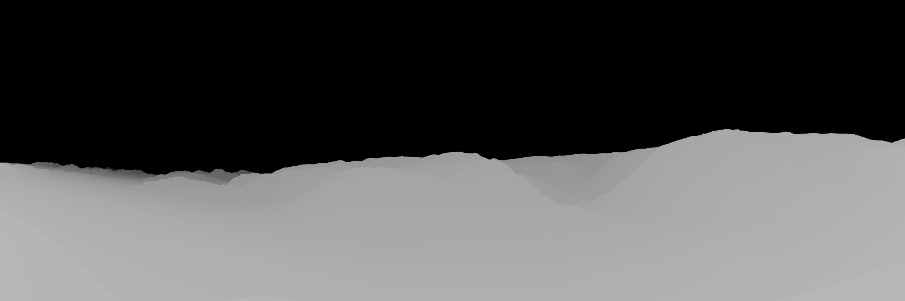
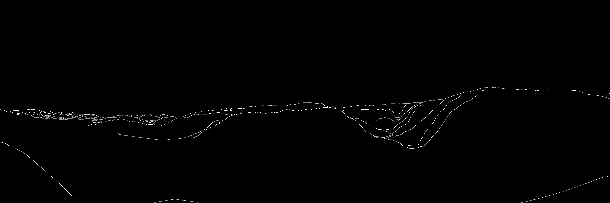
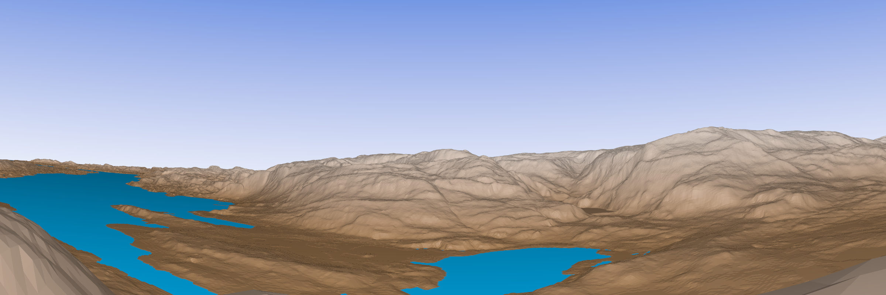

# Digital Elevation Model to Depth Map

A script for rendering a depth map from a given digital elevation model (DEM). Additional features are Canny Edge Detection and a 'world like' rendering of the map in 3D, which includes coloring of the terrain and sky.

## Example

In this example I will be using a digital elevation map from the region around Bergen in Norway. The map looks like this when hillshaded, and if provided as a `.dem` or `.tif` file then `gdal_translate` will be called for converting it to a `.png`.

The user chooses camera position and where the camera will be pointed towards, and a `.pov` file for generating a depth map from the camera position will be created. `povray` computes a depth map image, and the result when looking from Strandafjellet towards Ulriken in Bergen can be seen here.

When the depth map is created, `OpenCV` is used to provide a tool for handling Canny Edge Detection for the depth map image, and the user can adjust the lower and upper bounds for fine-tuning how the edges should look in the final image. Using the canny edge detection on the image above, the result is this image showing the contour lines of the mountains around the central region of Bergen.

## Bonus

I also added the option for just creating a 3D rendering looking from a given location towards another, and the `.pov` file for this includes coloring of the sky and mountains, aswell as blue color for areas at sea level. To enable this feature, just set `color_mode` to `True` in the `pov_generator` file. A result using this feature can be seen here, from the same location as in the example above.

