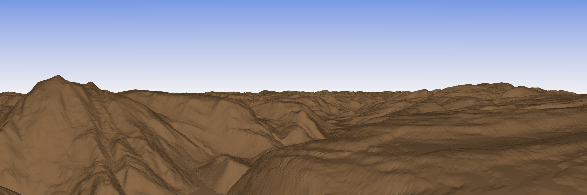

# DEM to Depthmap

*gdal and povray must be installed before running the script*

Run ```python3 main.py filename``` where filename is the digital elevation model you want to render. After running the script with a DEM as argument the panorama image created looks like this:


Running with a lower point of view and removing the color gradient results in panoramas like this one:


Adding color to the sky and ground adds a more natural look to the scene:


