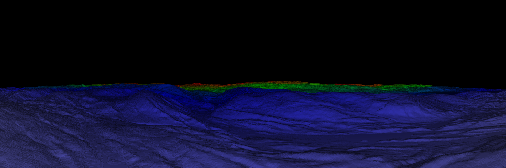
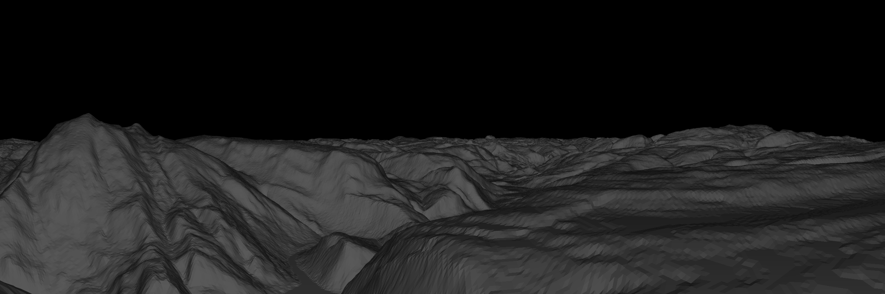

# DEM to Depthmap

Run ```python3 pov_gen.py filename``` where filename is the digital elevation model you want to render. After running the script with a DEM as argument the panorama image created looks like this:


Running with a lower point of view and removing the color gradient results in panoramas like this one:

